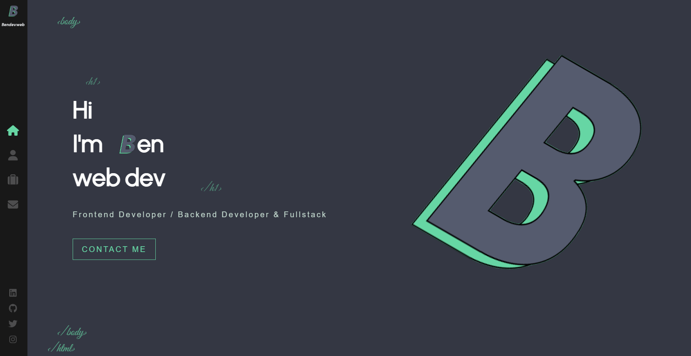

# Personal **Portfolio** 🏅

<p style="background-color: #555b6e; border-radius: 4px; text-align: center; color: #66d6a4; margin-top: 15px; margin-bottom: 15px; padding: 5px">My portfolio is still in development and is not yet responsive 😉</p>

#

<!-- 🙋‍♂️ 🪩 🪅
! Revoir Deployment Github pages
npm install --save gh-pages
"homepage": "https://Neocor89.github.io/portfolio",
I am a developer passionate about creating through programming,
but also about new technologies and learning.
I like my code to be efficient and clean
-->

> This project was bootstrapped with :

 



#

In the project directory, you can run:

```shell
npm run start
```

Runs the app in the development mode.\
Open [http://localhost:3000](http://localhost:3000) to view it in your browser.

The page will reload when you make changes.\
You may also see any lint errors in the console.

## Learn More on _React_

To learn React, check out the [React documentation](https://reactjs.org/).
